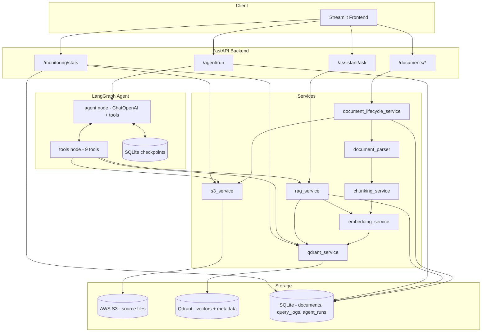

# Enterprise Knowledge Assistant

An agentic RAG platform that turns a company's document library (stored in AWS S3) into a searchable, cited, conversational knowledge base — with both a grounded single-shot Q&A mode and a LangGraph-powered multi-step agent that searches, compares, summarizes, and reasons across documents using tools.

## Features

- Lists and syncs documents from an AWS S3 bucket, tracking indexing status (and ETag, to skip unchanged files) in a local SQLite database
- Parses PDF, TXT, and DOCX files, splits them into chunks, embeds them with OpenAI, and stores them in Qdrant with deterministic point IDs so re-indexing updates in place instead of duplicating
- Grounded RAG Q&A: retrieves the top-k most relevant chunks above a score threshold, and only cites the chunks the model actually used — not everything retrieved
- A LangGraph agent with 9 tools (search, department-scoped search, list S3/indexed documents, inspect metadata, summarize a document, compare two documents, knowledge-base statistics, and a direct RAG answer tool) for multi-step questions a single retrieval pass can't answer
- Per-`thread_id` agent conversation memory via a SQLite checkpointer, kept fully separate from the document vector store
- Dashboard + Agent Monitor pages logging every question and agent run (latency, tools used, grounded/ungrounded, errors)
- Runnable locally or via Docker Compose with healthchecks and service-name networking

## Tech stack

- Streamlit frontend
- FastAPI backend
- Qdrant vector database
- LangGraph for the multi-step agent
- OpenAI for embeddings and chat completions
- AWS S3 for source documents
- SQLite for document tracking, query logs, agent runs, and agent checkpoints
- Docker Compose for local orchestration

## Running locally

Create the environment and install dependencies:

```powershell
python -m venv .venv
.venv\Scripts\Activate.ps1
pip install -r backend\requirements.txt
pip install -r frontend\requirements.txt
```

Copy `.env.example` to `.env` and fill in at minimum `OPENAI_API_KEY` and `AWS_S3_BUCKET`:

```powershell
copy .env.example .env
```

AWS credentials should be configured with `aws configure` or an IAM role — this project reads them from the standard AWS credential chain, not from `.env`.

For running tests, install the dev extras instead of the plain backend requirements:

```powershell
pip install -r backend\requirements-dev.txt
```

### Start the services

Start Qdrant:

```powershell
docker compose up -d qdrant
```

Start the backend:

```powershell
cd backend
uvicorn app.main:app --reload --port 8000
```

Start the frontend (second terminal, from the project root):

```powershell
cd frontend
streamlit run app.py
```

Open http://localhost:8501. On the **Documents** page, click **Sync from S3** to index everything (or upload a file directly from the **Upload** tab, which indexes it automatically).

### Run everything in Docker instead

```powershell
docker compose up --build
```

Starts Qdrant, the backend, and the frontend together with service-name networking (`http://qdrant:6333`, `http://backend:8000`), healthchecks, and persistent volumes. The backend container needs AWS credentials to reach S3 — either add `AWS_ACCESS_KEY_ID` / `AWS_SECRET_ACCESS_KEY` to `.env`, or mount your local `~/.aws` directory read-only via `docker-compose.yml`.

| Service | URL |
|---|---|
| Frontend | http://localhost:8501 |
| Backend docs | http://localhost:8000/docs |
| Qdrant dashboard | http://localhost:6333/dashboard |

## How it works

1. A document is synced from S3, parsed by file type (PDF/TXT/DOCX), chunked, embedded with OpenAI, and upserted into Qdrant using deterministic point IDs — so re-syncing updates in place instead of duplicating.
2. A question is embedded, matched against Qdrant by similarity, filtered by score threshold, and answered by the LLM using only the retrieved chunks it actually cites — returned with a grounded/ungrounded flag and per-chunk sources.
3. For multi-step questions, a LangGraph agent binds nine tools to the chat model and loops between reasoning and tool execution until it reaches a final answer or a hard step limit — conversation memory persists per `thread_id`, independent of the document vector store.
4. Every question and agent run is logged to SQLite and surfaced on the Dashboard and Agent Monitor pages.

## Configuration

Everything the app needs is environment-driven — edit `.env`:

| Field | What to put |
|---|---|
| `OPENAI_API_KEY` | Your OpenAI API key |
| `AWS_S3_BUCKET` | The bucket your documents live in |
| `AWS_S3_PREFIX` | Key prefix to scan, e.g. `Documents/` |
| `QDRANT_URL` | `http://localhost:6333` for local, or your Qdrant Cloud URL |
| `EMBEDDING_MODEL` | Defaults to `text-embedding-3-small` |
| `CHAT_MODEL` | Defaults to `gpt-4o-mini` |
| `RAG_TOP_K` | How many chunks to retrieve per question (default `5`) |
| `RAG_SCORE_THRESHOLD` | Minimum cosine similarity to keep a match (default `0.2`) |
| `AGENT_MAX_STEPS` | Hard cap on agent graph steps, prevents infinite loops (default `8`) |

Full reference:

| Variable | Required | Default | Purpose |
|---|---|---|---|
| `OPENAI_API_KEY` | Yes | — | Embeddings + chat completions |
| `AWS_S3_BUCKET` | Yes | — | Source document bucket |
| `AWS_REGION` | No | `us-east-1` | S3 region |
| `AWS_S3_PREFIX` | No | `documents/` | S3 key prefix to scan |
| `QDRANT_URL` | No | `http://localhost:6333` | Vector database URL |
| `QDRANT_API_KEY` | No | — | Only needed for Qdrant Cloud |
| `QDRANT_COLLECTION` | No | `enterprise_documents` | Collection name |
| `EMBEDDING_MODEL` | No | `text-embedding-3-small` | OpenAI embedding model |
| `CHAT_MODEL` | No | `gpt-4o-mini` | OpenAI chat model (RAG + agent) |
| `RAG_TOP_K` | No | `5` | Default chunks retrieved per question |
| `RAG_SCORE_THRESHOLD` | No | `0.2` | Minimum cosine similarity to keep a match |
| `AGENT_MAX_STEPS` | No | `8` | Hard cap on agent graph steps |
| `BACKEND_URL` | No | `http://localhost:8000` | Frontend → backend URL |

### Adjusting retrieval and agent behavior

Change `RAG_TOP_K` / `RAG_SCORE_THRESHOLD` in `.env` to tune retrieval breadth and strictness. Change `AGENT_MAX_STEPS` to give complex multi-step questions more room before the agent is force-stopped. Restart the backend after any `.env` change — `uvicorn --reload` does not pick up environment variable changes on its own.

### Adding your own agent tools

Agent tools live in `backend/app/agents/tools.py` as plain `@tool`-decorated functions with a docstring the model reads as the tool description. Add a new function, append it to `ALL_TOOLS` at the bottom of that file, and it's immediately available to the agent — no other wiring needed.

## Interface Workflow

1. Go to **Documents**, click **Sync from S3** (or upload a new file — it auto-indexes).
2. Ask questions on the **AI Assistant** page for grounded single-shot answers with cited sources.
3. Ask multi-step questions on the **Agent Monitor** page (e.g. "compare X and Y") and inspect the full tool-call trace.
4. Check the **Dashboard** for document/vector counts, question and agent-run volume, and average latencies.

## API Reference

### Documents — `/documents`

| Method | Path | Description |
|---|---|---|
| GET | `/documents/s3` | List supported documents in S3 |
| GET | `/documents/indexed` | List documents tracked in the DB with status/chunk count |
| POST | `/documents/upload` | Upload a file (multipart), store in S3, auto-index |
| POST | `/documents/sync` | Index new/changed S3 documents, skip unchanged (by ETag) |
| POST | `/documents/reindex?s3_key=...&filename=...` | Force re-index one document |
| DELETE | `/documents/vectors?s3_key=...&delete_source=false` | Delete a document's vectors (optionally the S3 file too) |
| POST | `/documents/preview?s3_key=...` | Parse + chunk without embedding (first 5 chunks) |
| POST | `/documents/index?s3_key=...` | Parse, chunk, embed, and index one document |

### Assistant — `/assistant`

| Method | Path | Description |
|---|---|---|
| POST | `/assistant/ask` | Body: `{question, top_k?, score_threshold?}`. Grounded single-shot RAG answer with cited sources. |

### Agent — `/agent`

| Method | Path | Description |
|---|---|---|
| POST | `/agent/run` | Body: `{question, thread_id?}`. Multi-step LangGraph agent run with full execution trace. Omit `thread_id` to start a new conversation. |

### Monitoring — `/monitoring`

| Method | Path | Description |
|---|---|---|
| GET | `/monitoring/stats` | Document/vector counts, question and agent-run counts, average latencies, recent errors, recent agent runs |

### Health

| Method | Path | Description |
|---|---|---|
| GET | `/health` | Backend liveness |
| GET | `/health/qdrant` | Qdrant connectivity + collection list |

### Terminal equivalents (curl)

```powershell
curl http://localhost:8000/documents/s3
curl -X POST http://localhost:8000/documents/sync
curl -X POST http://localhost:8000/assistant/ask -H "Content-Type: application/json" -d "{\"question\": \"What is the remote work policy?\"}"
curl -X POST http://localhost:8000/agent/run -H "Content-Type: application/json" -d "{\"question\": \"Compare the employee handbook with the leave policy.\"}"
curl http://localhost:8000/monitoring/stats
```

## Sample Questions

Standard Q&A (AI Assistant page):

- "What is the remote work policy?"
- "How many vacation days do employees get?"
- "What's the process for setting up VPN access?"

Multi-step (Agent Monitor page):

- "Compare the employee handbook with the leave policy."
- "How many finance documents are in S3, and summarize the travel policy?"
- "Find the newest HR policy and explain its main rules."
- "List IT documents and answer how employees reset their VPN password."

## Running Tests

```powershell
cd backend
pip install -r requirements-dev.txt
pytest -v
```

24 tests, all external services (S3, Qdrant, OpenAI) mocked so the suite runs offline and deterministically. Covers chunking behavior, deterministic Qdrant point IDs (idempotent re-indexing), document parsing (TXT/DOCX/PDF, unicode, case-insensitive extensions, unsupported-type errors), RAG score-threshold filtering and grounded/ungrounded citation logic, and FastAPI endpoint behavior.

## Limits

| Limit | Detail |
|---|---|
| Answers are grounded-only | The system prompt instructs the model to answer only from retrieved context; if nothing relevant is retrieved, it says so instead of guessing. |
| Agent steps are capped | `AGENT_MAX_STEPS` (default 8) force-stops the agent to bound worst-case cost and latency — a genuinely complex question may need this raised. |
| Upload doesn't infer department folders | Files upload to whatever folder you pick in the UI (or the bucket root); there's no automatic classification. |
| `.env` changes need a full restart | `uvicorn --reload` and Streamlit's autoreload both only watch source files, not environment variables. |
| Docker containers don't hot-reload | Code changes require `docker compose up --build -d`, not just a restart. |
| SQLite checkpointer opens per request | Fine at this scale; a high-concurrency deployment would want a connection pool instead. |

## Troubleshooting

`{"detail":"Unable to list documents from AWS S3: ..."}` — `AWS_S3_BUCKET` is likely still a placeholder, or your AWS credentials aren't configured or lack S3 permissions.

Streamlit shows `ImportError: cannot import name 'X' from 'utils.api_client'` — Streamlit's autoreload re-executes the page script but does not reload already-imported submodules. Stop Streamlit completely and restart it; a page refresh alone won't pick up changes to imported modules.

Backend changes not taking effect despite `--reload` — `.env` changes are never picked up by `--reload`; restart the backend fully. If you started the backend from more than one terminal, multiple processes can end up bound to port 8000 simultaneously — check with `netstat -ano | findstr :8000` and kill stray processes.

Agent tools report 0 indexed documents despite Qdrant having vectors — happens if documents were indexed before the SQLite tracking table existed, or if `data/app.db` was deleted. Run **Sync from S3** to backfill records.

AccessDenied from AWS even though your CLI credentials work — a specific terminal session can end up with different (stale) AWS credentials in its process environment than your shared credentials file. Close and reopen the terminal running the backend.

Agent runs hit `step_limit_reached` — the graph is capped at `AGENT_MAX_STEPS` specifically to prevent infinite tool-calling loops. Raise it in `.env` if a legitimate multi-step question needs more room.

## Architecture



See [How it works](#how-it-works) above for the step-by-step data flow this diagram represents.

## Project Highlights

This project is a portfolio piece demonstrating an end-to-end agentic RAG system, built to explore how far retrieval-augmented generation can go when paired with a real multi-step reasoning agent instead of a single retrieval pass.

**Two retrieval modes over one document store.** Documents come from S3, get parsed by file type, chunked with a recursive splitter, embedded with OpenAI, and stored in Qdrant using deterministic UUIDs derived from `(s3_key, page, chunk_index)` — which makes re-indexing idempotent instead of creating duplicate vectors on every run.

**Grounded single-shot RAG.** Embed the question, retrieve the top-k chunks above a relevance threshold, and have the model answer using only that context — returning structured JSON so the answer's groundedness is explicit, and citing only the specific chunks the model actually used, not everything retrieved.

**A real multi-step agent, not just a chatbot wrapper.** The agent path is a LangGraph state graph: a typed state with a message list, an accumulating execution trace, and a step counter; an agent node that binds nine tools to a chat model; and a tools node that executes whatever the model requested, timing each call and feeding results back. Conditional edges route between them until the model stops requesting tools or a hard step limit is hit, which bounds worst-case cost and latency. Conversation memory is kept separate from document knowledge: LangGraph's SQLite checkpointer persists message history per `thread_id`, independent of the Qdrant vector store, so a follow-up question can reuse prior context without re-searching.

**Consistent error handling across external dependencies.** Everything that talks to an external system — S3, Qdrant, OpenAI, the LangGraph engine — normalizes its own SDK's exceptions into a plain `RuntimeError` with `raise ... from exc`, giving the API layer one consistent contract to catch regardless of which dependency failed. The tool executor and top-level agent runner are the deliberate exception to "never catch broad `Exception`," since they sit at a boundary invoking heterogeneous code where no single specific exception type would be reliable.

## Author

Built by **Geetha Ponugoti**.
